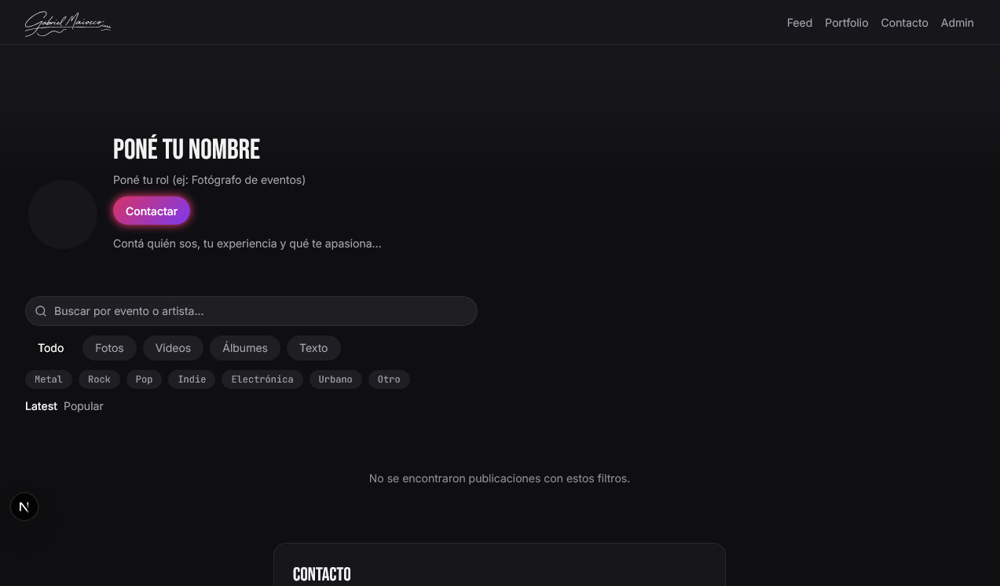
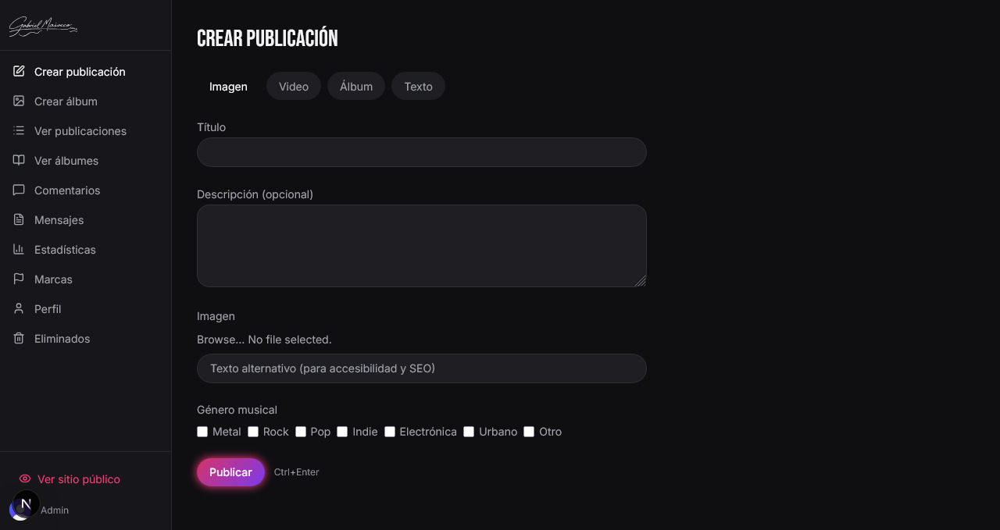
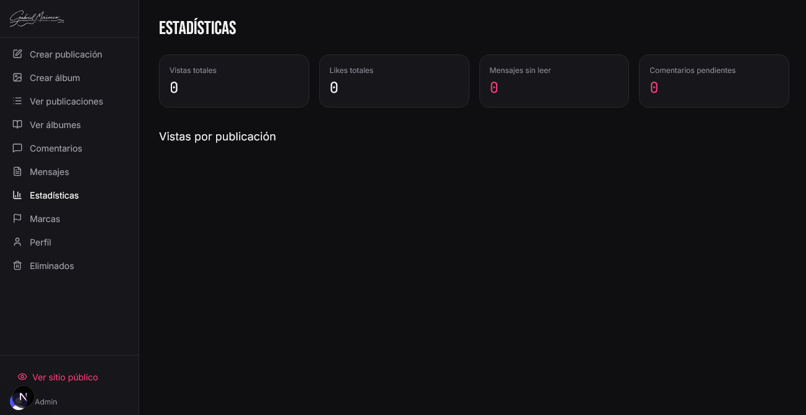
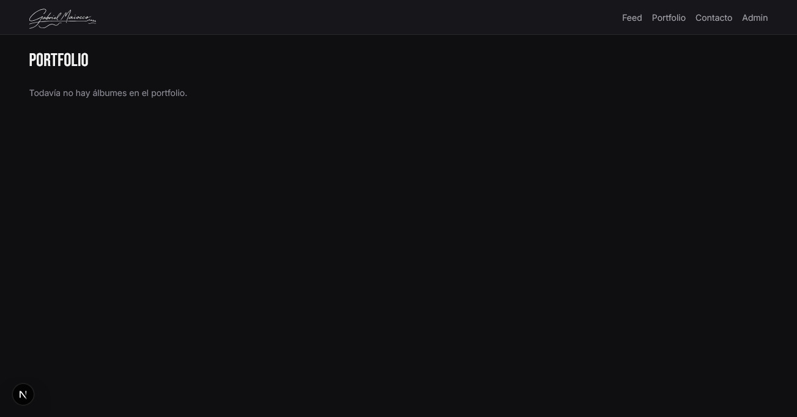

<p align="center">
  
</p>

<h1 align="center">Gabriel Maiocco — Blog & Portfolio</h1>


A photography event coverage portfolio and blog with a private admin panel, built for a single client who needs to showcase work to producers and event organizers.

> Built by [Ezequiel Ranieri](https://github.com/ezequielranieri)
> — Backend & Security Engineer specialized in Distributed Systems

## Installation

```bash
pnpm install
```

## What is this project?

I built this portfolio to bridge the gap between a traditional Instagram feed and a professional photographer's business presence. The client needed a place where event producers could see his work presented cleanly, browse albums by music genre, and download a Media Kit — all in one place, without social media distractions.

The result is a dual-site: a **public feed** where anyone can browse photos, videos, albums and text posts filtered by type or genre, and a **private admin panel** where the client manages everything — from uploading content to moderating comments and tracking post views.

## Quick Demo

Visit the public feed to see the latest posts, filter by genre or type, and view albums as fullscreen stories or carousels:

```text
https://gabrielmaiocco.vercel.app/
  ├── Feed — Image, video, album carousel, and text posts
  ├── Stories — Highlighted albums as Instagram-style circles
  ├── Portfolio — Curated grid of event albums
  ├── Contact — In-app form with 3 categories
  └── /post/[slug] — Individual post pages with OG metadata
```

The admin panel lives behind authentication:

```text
https://gabrielmaiocco.vercel.app/admin
  ├── Crear publicación — Unified form for all 4 post types
  ├── Crear álbum — Album builder with auto-post generation
  ├── Publicaciones / Álbumes — List and manage all content
  ├── Comentarios — Approve/reject comments before public
  ├── Mensajes — Filterable contact inbox
  ├── Estadísticas — View counts and popular ranking
  ├── Marcas — Brand partner management
  ├── Perfil — Photo, cover with focal point, bio, social links
  └── Eliminados — Soft-deleted items with 30-day purge
```






## Features

- ✅ **4 Post Types:** Image (Instagram-style), Video (TikTok/Instagram/Native), Album (carousel), Text (X-style)
- 🎵 **Genre Taxonomy:** 7 music genres — filterable and combinable in the feed
- 📸 **Stories:** Highlighted albums as circles with fullscreen viewer and segmented progress bar
- 🔍 **Smart Filters:** Combine type, genre, text search, and sort by Latest or Popular
- ♥️ **Likes & Comments:** Public engagement with Upstash rate limiting and comment moderation
- 🖼️ **Focal Point Editor:** Click-to-set crop alignment for profile photo and cover image
- 📄 **Media Kit:** One-click PDF download for producers
- 🏢 **Brand Partners:** Horizontal grid of client logos
- 📧 **Contact Form:** 3 categories (Press, Advertising, General) with admin inbox
- 📊 **Analytics:** Per-post view counter, popular score (likes×3 + views)
- 🔒 **Soft Delete:** Logical deletion with 30-day automatic purge
- 🧹 **Rate Limiting:** Upstash Redis — 10 actions/min per IP on public endpoints
- 🎨 **Dark Mode:** Forced dark theme with custom design system tokens
- 📱 **Responsive:** Mobile-first with lazy-loaded cards, intersection observer pagination
- 🔍 **SEO:** Dynamic metadata, Open Graph images (Edge), JSON-LD, sitemap, robots
- 🖼️ **Lightbox:** Fullscreen image viewer for photo posts
- ⚡ **LQIP:** Blur placeholders on all Sanity images
- 🌀 **Page Transitions:** Fade+slide on every navigation

## Tech Stack & Decisions

| Area | Choice | Why |
| :--- | :--- | :--- |
| **Framework** | Next.js 16 (App Router) | Modern React, Turbopack, ISR, Edge Runtime |
| **CMS** | Sanity v5 (headless) | Image pipeline with CDN, GROQ, hotpot support |
| **Auth** | Clerk (email-only) | Single admin user, no public sign-up |
| **Styling** | Tailwind CSS v4 | Custom theme tokens, no config file |
| **Animation** | CSS transitions + framer-motion | Motion only loaded lazily for StoryViewer |
| **Validation** | Zod v4 | Server Action input validation |
| **Rate Limit** | Upstash Redis | Reused for views, likes, comments, and contact |
| **Fonts** | Inter + Bebas Neue + JetBrains Mono | Display, body, and monospace |
| **Deploy** | Vercel | Edge functions, ISR, cron jobs |

## Architecture

```text
src/
├── app/                    # Next.js App Router
│   ├── (auth)/             # Clerk sign-in route group
│   ├── admin/              # Private admin panel
│   │   ├── crear/          # Create post Server Actions
│   │   ├── albumes/        # Album CRUD
│   │   ├── posts/          # Post editing
│   │   ├── comentarios/    # Comment moderation
│   │   ├── mensajes/       # Contact inbox
│   │   ├── estadisticas/   # View analytics
│   │   ├── marcas/         # Brand management
│   │   ├── perfil/         # Profile settings
│   │   └── eliminados/     # Soft-deleted items
│   ├── api/                # Route Handlers
│   │   ├── admin/upload-*  # File uploads
│   │   ├── oembed/         # TikTok & Instagram embeds
│   │   ├── og/             # Dynamic OG images
│   │   └── cron/           # 30-day purge job
│   ├── portfolio/          # Public portfolio
│   └── post/               # Individual post pages
├── components/
│   ├── ui/                 # 6 base UI primitives
│   ├── feed/               # 20 public components
│   ├── admin/              # 11 admin components
│   └── shared/             # 7 shared components
├── lib/
│   ├── sanity/             # Read & write clients
│   ├── services/           # 12 service modules
│   ├── validations/        # Zod schemas
│   └── ...                 # Rate limit, Redis, utils
├── types/                  # TypeScript interfaces
└── proxy.ts                # Clerk middleware
```

## Patterns & Key Decisions

- **File uploads** go through a Route Handler (`/api/admin/upload-*`), never inside a Server Action FormData (avoids Turbopack "Unexpected end of form" bug).
- **ClerkProvider** wraps only admin/auth layouts, never the root — Clerk JS never loads on public pages.
- **AdminPostActions** receives `isAdmin` as a server-side prop, not via `useAuth()` — removes Clerk dependency from public components.
- **Framer Motion** is dynamically imported only for `StoryViewer`. Public cards use CSS `scale` transitions and `transition-transform`.
- **Album creation** auto-generates a linked Post — one form, no manual step.
- **Soft delete** with 30-day purge for posts and albums; real delete for brands, rejected comments, and messages.
- **Likes** are local-only (`hasLiked` state resets on reload) — no user accounts needed. Rate limiting prevents spam.
- **portfolioOrder** controls album sorting in Portfolio; albums without a value fall back to chronological order.
- **Instagram embeds** use direct iframe (`/p/{shortcode}/embed/`) instead of Graph API (requires App Review).

## Sanity CORS

Antes de deployar, agregá el dominio en [sanity.io/manage](https://sanity.io/manage) → Project → API → CORS origins:

- `https://gabrielmaiocco.vercel.app` (o tu dominio custom) con `Allow credentials: true`

Sin esto, las imágenes y assets de Sanity no cargan en producción.

## Environment Variables

```env
# Clerk
NEXT_PUBLIC_CLERK_PUBLISHABLE_KEY=
CLERK_SECRET_KEY=
NEXT_PUBLIC_CLERK_SIGN_IN_URL=/admin/sign-in
NEXT_PUBLIC_CLERK_SIGN_IN_FALLBACK_REDIRECT_URL=/admin

# Sanity
NEXT_PUBLIC_SANITY_PROJECT_ID=
NEXT_PUBLIC_SANITY_DATASET=
NEXT_PUBLIC_SANITY_API_VERSION=2024-01-01
SANITY_API_WRITE_TOKEN=

# Upstash Redis
UPSTASH_REDIS_REST_URL=
UPSTASH_REDIS_REST_TOKEN=

# Site
NEXT_PUBLIC_SITE_URL=https://gabrielmaiocco.vercel.app
NEXT_PUBLIC_SITE_NAME=Gabriel Maiocco

# Instagram oEmbed (optional — falls back to direct iframe)
INSTAGRAM_OEMBED_ACCESS_TOKEN=

# Cron (optional — for Vercel Cron Jobs)
CRON_SECRET=
```

## Lighthouse

| Metric | Desktop | Mobile |
| :--- | :---: | :---: |
| **Performance** | 100 | 87 |
| **Accessibility** | 100 | 100 |
| **Best Practices** | 100 | 96 |
| **SEO** | 100 | 100 |

## Known Limitations

- **CSP** not fully enforced — `next/dynamic` and Clerk require `'unsafe-inline'` on scripts. A custom server with per-request nonces would resolve it.
- **Source maps** with Turbopack don't link correctly in production (Next.js 16 known issue).
- **Instagram oEmbed** via Graph API requires App Review approval; falls back to direct iframe embed.

## Roadmap

1. **Phase 1 (Setup):** Next.js + Tailwind + Sanity + base dependencies. ✅
2. **Phase 2 (Design System):** Dark mode tokens, typography, UI primitives. ✅
3. **Phase 3 (CMS Schemas):** Post, Album, Brand, Profile, Message, Comment. ✅
4. **Phase 4 (Auth):** Clerk, proxy, sign-in route group. ✅
5. **Phase 5 (Admin — Create):** Unified post form, album auto-post, file uploads. ✅
6. **Phase 6 (Admin — Edit/Delete):** In-place editing, soft delete, 30-day cron purge. ✅
7. **Phase 7 (Public Feed):** Pagination, filters, 4 post types, lazy cards. ✅
8. **Phase 8 (Stories):** Circle indicators, fullscreen viewer, album carousel. ✅
9. **Phase 9 (Video Embeds):** TikTok oEmbed, Instagram, native Sanity video. ✅
10. **Phase 10 (Profile & Portfolio):** Hero, portfolio grid, brands, profile CRUD. ✅
11. **Phase 11 (Interactions):** Likes, comments, search, rate limiting. ✅
12. **Phase 12 (Contact):** Public form, admin inbox with category filters. ✅
13. **Phase 13 (Analytics):** View counter, popular ranking, stats dashboard. ✅
14. **Phase 14 (SEO):** Dynamic metadata, OG images, JSON-LD, sitemap, ISR. ✅
15. **Phase 15 (Deploy):** Vercel config, domain, final verification. ✅

## Author

**Ezequiel Ranieri**  
Backend & Security Engineer | Distributed Systems & Authentication  
📧 ez.ranieri@gmail.com  
🐙 [GitHub](https://github.com/ezequielranieri)  
💼 [LinkedIn](https://www.linkedin.com/in/ezequielranieri)

---

**Cliente:** Gabriel Maiocco — Event & Concert Photographer  
📸 [Instagram](https://instagram.com/gabrielmaiocco) · 🎵 [TikTok](https://tiktok.com/@gabrielmaiocco)

## License

MIT License
